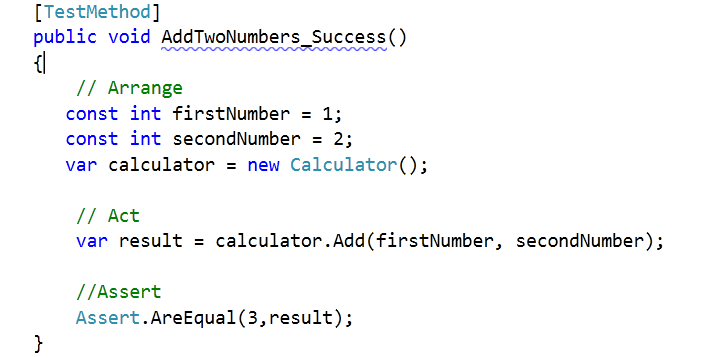
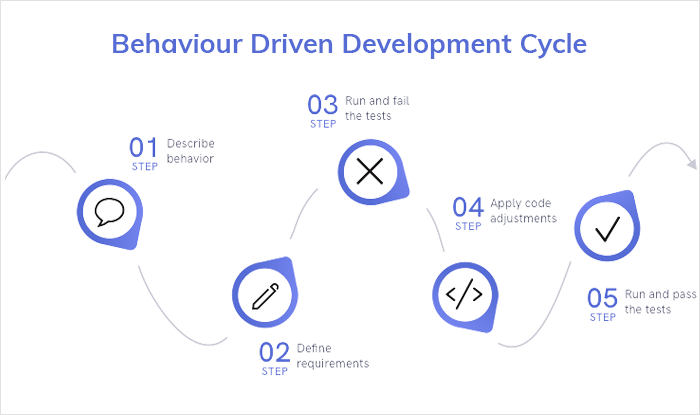

# Testing

## Test name conventions

### `MethodName_StateUnderTest_ExpectedBehavior`

There are arguments against this strategy that if method names change as part of code refactoring than test name like this should also change or it becomes difficult to comprehend at a later stage. Following are some of the example:

- isAdult_AgeLessThan18_False
- withdrawMoney_InvalidAccount_ExceptionThrown
- admitStudent_MissingMandatoryFields_FailToAdmit

### `MethodName_ExpectedBehavior_StateUnderTest`

Slightly tweeked from above, but a section of developers also recommend using this naming technique. This technique also has disadvantage that if method names get changed, it becomes difficult to comprehend at a later stage. Following is how tests in first example would read like if named using this technique:

- isAdult_False_AgeLessThan18
- withdrawMoney_ThrowsException_IfAccountIsInvalid
- admitStudent_FailToAdmit_IfMandatoryFieldsAreMissing

### `test[Feature being tested]`

This one makes it easy to read the test as the feature to be tested is written as part of test name. Although, there are arguments that the “test” prefix is redundant. However, some sections of developer love to use this technique. Following is how the above tests would read like if named using this technique:

- testIsNotAnAdultIfAgeLessThan18
- testFailToWithdrawMoneyIfAccountIsInvalid
- testStudentIsNotAdmittedIfMandatoryFieldsAreMissing

### `Feature to be tested`

Many suggests that it is better to simply write the feature to be tested because one is anyway using annotations to identify method as test methods. It is also recommended for the reason that it makes unit tests as alternate form of documentation and avoid code smells. Following is how tests in first example would read like if named using this technique:

- IsNotAnAdultIfAgeLessThan18
- FailToWithdrawMoneyIfAccountIsInvalid
- StudentIsNotAdmittedIfMandatoryFieldsAreMissing

### `Should_ExpectedBehavior_When_StateUnderTest`

This technique is also used by many as it makes it easy to read the tests. Following is how tests in first example would read like if named using this technique:

- Should_ThrowException_When_AgeLessThan18
- Should_FailToWithdrawMoney_ForInvalidAccount
- Should_FailToAdmit_IfMandatoryFieldsAreMissing

### `When_StateUnderTest_Expect_ExpectedBehavior`

Following is how tests in first example would read like if named using this technique:

- When_AgeLessThan18_Expect_isAdultAsFalse
- When_InvalidAccount_Expect_WithdrawMoneyToFail
- When_MandatoryFieldsAreMissing_Expect_StudentAdmissionToFail

### `Given_Preconditions_When_StateUnderTest_Then_ExpectedBehavior`

This approach is based on naming convention developed as part of Behavior-Driven Development (BDD). The idea is to break down the tests into three part such that one could come up with preconditions, state under test and expected behavior to be written in above format. Following is how tests in first example would read like if named using this technique:

- Given_UserIsAuthenticated_When_InvalidAccountNumberIsUsedToWithdrawMoney_Then_TransactionsWillFail

## Concepts

### `Arrange/Act/Assert pattern`

Each method should group these functional sections, separated by blank lines:

1. Arrange all necessary preconditions and inputs.
2. Act on the object or method under test.
3. Assert that the expected results have occurred.

## Metodologies

### `Test-Driven Development`

Test-driven development (TDD) is a software development process relying on software requirements being converted to test cases before software is fully developed, and tracking all software development by repeatedly testing the software against all test cases. This is as opposed to software being developed first and test cases created later.

### `Behavior-Driven Development`

In software engineering, behavior-driven development (BDD) is an agile software development process that encourages collaboration among developers, quality assurance testers, and customer representatives in a software project. It encourages teams to use conversation and concrete examples to formalize a shared understanding of how the application should behave. It emerged from test-driven development (TDD). Behavior-driven development combines the general techniques and principles of TDD with ideas from domain-driven design and object-oriented analysis and design to provide software development and management teams with shared tools and a shared process to collaborate on software development.

## Sources

- <https://dzone.com/articles/7-popular-unit-test-naming>
- <http://wiki.c2.com/?ArrangeActAssert>
- <https://en.wikipedia.org/wiki/Test-driven_development>
- <https://en.wikipedia.org/wiki/Behavior-driven_development>
- <https://seminda.files.wordpress.com/2012/04/image21.png>
- <https://d112uwirao0vo9.cloudfront.net/wp-content/uploads/2020/12/tdd_flow1.gif>
- <https://www.mobileappdaily.com/public/uploads/mad_74308f941c.png>
